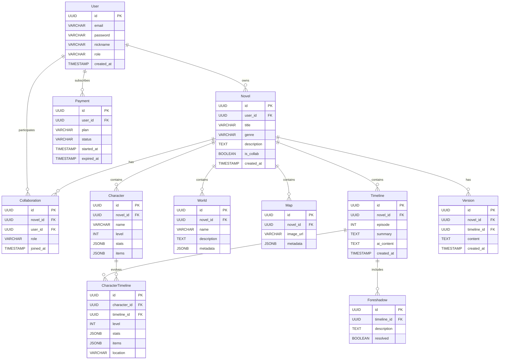

# 웹소설 쓰기 서비스 기획 문서 (plan.md)

## 1. 기술 스택

- **Backend**: Node.js + Nest.js
- **Frontend**: React.js
- **Database**:
  - **개발중**: 로컬 PostgreSQL
  - **실제 서비스**: Oracle Autonomous Database (Always Free Tier), Redis (캐싱 및 세션 관리)
- **AI 기능**: OpenAI API 또는 유사 LLM API 연동
- **결제 시스템**: Stripe, PayPal API
- **실시간 협업**: WebSocket, WebRTC
- **버전 관리**: Git-like 구조, DB 기반 버전 기록
- **클라우드 인프라**: Oracle Cloud Infrastructure (OCI) Free Tier

---

## 2. 주요 페이지 설계

### 2.1 회원 관련

- 
- 회원가입 / 로그인 페이지
- 마이페이지 (내 소설 목록, 프로필 수정, 구독/결제 관리)

### 2.2 소설 관리

- 
- 
- 새 소설 쓰기 페이지
- 소설 대시보드 (캐릭터 관리, 세계관 관리, 세계지도 관리, 타임라인 관리, 복선 마커 관리, AI 글쓰기)

### 2.3 텍스트 편집기 (핵심 기능)

- 
- 
- **위치**: 화면 중앙에 배치
- **기능**
  - 기본 글쓰기/편집 (Rich Text Editor, Markdown 지원)
  - AI 글쓰기와 연동 (줄거리 입력 → AI 상세 내용 자동 삽입)
  - 타임라인과 연결 (특정 화 선택 시 해당 화의 텍스트 불러오기)
  - 캐릭터/세계관/지도 정보와 연동 (사이드바에서 참조 가능)
  - 복선 마커 삽입 기능 (텍스트 내 특정 부분에 태그 삽입)
  - 버전 관리와 연동 (이전 버전 복원, 비교 뷰 제공)
- **UI 구성**
  - 중앙: 텍스트 편집기
  - 좌측: 캐릭터/세계관/지도 관리 패널
  - 하단: 타임라인 뷰
  - 우측: AI 글쓰기/복선 마커/버전 관리 도구

### 2.4 캐릭터 관리

- 
- 
- 캐릭터 생성/수정
- 능력치, 레벨, 아이템 관리
- 타임라인별 상태 변화 기록

### 2.5 세계관 관리

- 
- 세계관 설정 (종족, 국가, 역사 등)
- 세계관 요소 연결

### 2.6 세계지도 관리

- 지도 업로드/생성
- 캐릭터 위치 표시
- 타임라인에 따른 위치 변화 추적

### 2.7 타임라인 관리

- 각 화별 사건 기록
- 캐릭터 상태/위치 표시
- 복선 마커 표시 및 회수 여부 관리
- 텍스트 편집기와 연결 (해당 화의 텍스트 불러오기)

### 2.8 AI 글쓰기

- 줄거리 입력 → AI 상세 내용 생성
- 결과물 수정 및 저장
- 텍스트 편집기에 자동 삽입

### 2.9 결제/구독 관리

- 결제 페이지 (프리미엄 기능: AI 글쓰기 무제한, 고급 지도 편집)
- 구독 상태 확인 및 갱신

### 2.10 협업 기능

- 프로젝트 초대/참여 페이지
- 실시간 공동 편집 (WebSocket 기반)
- 권한 관리 (관리자, 편집자, 뷰어)

### 2.11 버전 관리

- 변경 이력 페이지
- 특정 버전 복원 기능
- 비교 뷰 (이전 버전과 현재 버전 차이 확인)
- 텍스트 편집기와 직접 연결

### 2.12 대문

- 샘플 이미지
  - 
- 서비스 소개
- 서비스 로그인
- 서비스 장점
- 서비스 가격
- 서비스 문의

---

## 3. DB 설계 (Oracle Autonomous Database 기반)

> 기존 PostgreSQL 설계를 Oracle Autonomous Database에 맞게 조정  
> 주요 차이점: JSONB → CLOB 또는 JSON 데이터 타입, UUID → VARCHAR2(36)

### User

- id (VARCHAR2(36), PK)
- email (VARCHAR2(255))
- password (VARCHAR2(255))
- nickname (VARCHAR2(100))
- role (VARCHAR2(50): admin, user)
- created_at (TIMESTAMP)

### Novel

- id (VARCHAR2(36), PK)
- user_id (VARCHAR2(36), FK → User)
- title (VARCHAR2(255))
- genre (VARCHAR2(100))
- description (CLOB)
- is_collab (CHAR(1)) -- 'Y'/'N'
- created_at (TIMESTAMP)

### Character

- id (VARCHAR2(36), PK)
- novel_id (VARCHAR2(36), FK → Novel)
- name (VARCHAR2(100))
- level (NUMBER)
- stats (JSON) -- Autonomous DB JSON 타입
- items (JSON)

### World

- id (VARCHAR2(36), PK)
- novel_id (VARCHAR2(36), FK → Novel)
- name (VARCHAR2(100))
- description (CLOB)
- metadata (JSON)

### Map

- id (VARCHAR2(36), PK)
- novel_id (VARCHAR2(36), FK → Novel)
- image_url (VARCHAR2(255))
- metadata (JSON)

### Timeline

- id (VARCHAR2(36), PK)
- novel_id (VARCHAR2(36), FK → Novel)
- episode (NUMBER)
- summary (CLOB)
- ai_content (CLOB)
- created_at (TIMESTAMP)

### Foreshadow

- id (VARCHAR2(36), PK)
- timeline_id (VARCHAR2(36), FK → Timeline)
- description (CLOB)
- resolved (CHAR(1)) -- 'Y'/'N'

### CharacterTimeline

- id (VARCHAR2(36), PK)
- character_id (VARCHAR2(36), FK → Character)
- timeline_id (VARCHAR2(36), FK → Timeline)
- level (NUMBER)
- stats (JSON)
- items (JSON)
- location (VARCHAR2(255))

### Collaboration

- id (VARCHAR2(36), PK)
- novel_id (VARCHAR2(36), FK → Novel)
- user_id (VARCHAR2(36), FK → User)
- role (VARCHAR2(50): editor, viewer)
- joined_at (TIMESTAMP)

### Payment

- id (VARCHAR2(36), PK)
- user_id (VARCHAR2(36), FK → User)
- plan (VARCHAR2(50))
- status (VARCHAR2(50))
- started_at (TIMESTAMP)
- expired_at (TIMESTAMP)

### Version

- id (VARCHAR2(36), PK)
- novel_id (VARCHAR2(36), FK → Novel)
- timeline_id (VARCHAR2(36), FK → Timeline)
- content (CLOB)
- created_at (TIMESTAMP)

---

## 4. API 엔드포인트 설계

### 회원 관련

- `POST /auth/signup` → 회원가입
- `POST /auth/login` → 로그인
- `GET /users/me` → 내 정보 조회
- `PATCH /users/me` → 프로필 수정

### 소설 관리

- `POST /novels` → 새 소설 생성
- `GET /novels` → 내 소설 목록 조회
- `GET /novels/:id` → 소설 상세 조회
- `PATCH /novels/:id` → 소설 수정
- `DELETE /novels/:id` → 소설 삭제

### 캐릭터 관리

- `POST /novels/:id/characters`
- `GET /novels/:id/characters`
- `GET /characters/:id`
- `PATCH /characters/:id`
- `DELETE /characters/:id`

### 세계관 관리

- `POST /novels/:id/worlds`
- `GET /novels/:id/worlds`
- `PATCH /worlds/:id`
- `DELETE /worlds/:id`

### 지도 관리

- `POST /novels/:id/maps`
- `GET /novels/:id/maps`
- `PATCH /maps/:id`
- `DELETE /maps/:id`

### 타임라인 관리

- `POST /novels/:id/timelines`
- `GET /novels/:id/timelines`
- `GET /timelines/:id`
- `PATCH /timelines/:id`
- `DELETE /timelines/:id`

### 복선 관리

- `POST /timelines/:id/foreshadows`
- `GET /timelines/:id/foreshadows`
- `PATCH /foreshadows/:id`
- `DELETE /foreshadows/:id`

### AI 글쓰기

- `POST /ai/generate`

### 결제/구독

- `POST /payments/subscribe`
- `GET /payments/status`
- `POST /payments/cancel`

### 협업

- `POST /novels/:id/collaborators`
- `GET /novels/:id/collaborators`
- `PATCH /collaborators/:id`
- `DELETE /collaborators/:id`

### 버전 관리

- `GET /novels/:id/versions`
- `GET /versions/:id`
- `POST /versions/:id/restore`

### 텍스트 편집기 관련

- `POST /novels/:id/episodes/:episode/text` → 텍스트 저장
- `GET /novels/:id/episodes/:episode/text` → 텍스트 불러오기
- `PATCH /novels/:id/episodes/:episode/text` → 텍스트 수정
- `GET /novels/:id/episodes/:episode/versions` → 버전 목록 조회
- `POST /novels/:id/episodes/:episode/restore/:version_id` → 특정 버전 복원

---

## 5. ERD 다이어그램



---

## 6. 기능 흐름

1. 회원가입 → 로그인 → 마이페이지 진입
2. 새 소설 생성 → 소설 대시보드 이동
3. **텍스트 편집기에서 글 작성 시작**
4. 캐릭터/세계관/지도 관리 → 타임라인에 연결
5. 타임라인에서 캐릭터 상태 및 위치 확인
6. 복선 마커 추가 및 회수 여부 표시
7. 줄거리 입력 → AI 상세 내용 생성 → 텍스트 편집기에 삽입
8. 결제/구독 → 프리미엄 기능 활성화
9. 협업 초대 → 실시간 공동 편집 (텍스트 편집기 공유)
10. 버전 관리 → 변경 이력 확인 및 복원

---

## 7. 확장 고려사항

- Oracle Cloud Free Tier 환경에서 운영
- Autonomous Database의 JSON 지원 활용
- DB 백업 및 복구는 OCI 자동화 기능 사용
- 네트워크 보안: VCN, Security List, IAM 정책 적용
- 확장 시 Oracle APEX를 통한 관리 UI 고려 가능
- **결제 시스템**
  - Stripe/PayPal API 연동
  - 구독 플랜: Free / Premium / Team
  - Premium: AI 글쓰기 무제한, 고급 지도 편집
  - Team: 협업 기능 활성화

- **협업 기능**
  - 프로젝트 초대 (이메일/링크)
  - 실시간 공동 편집 (WebSocket, CRDT 기반 동기화)
  - 권한 관리 (관리자, 편집자, 뷰어)

- **버전 관리**
  - 각 타임라인/세계관/캐릭터 변경 시 자동 버전 생성
  - 특정 버전 복원 기능
  - 변경 비교 뷰 제공

- **추후 확장**
  - 모바일 앱 (React Native)
  - 커뮤니티 기능 (작품 공유, 피드백)
  - AI 기반 추천 (스토리 전개 방향, 캐릭터 성장 제안)
  - 다국어 지원 (글로벌 사용자 확대)
  - 오프라인 모드 (앱에서 로컬 저장 후 동기화)

---

## 8. 추가 고려사항 (API 통신 예시)

### 회원가입 요청 예시

```json
POST /auth/signup
{
  "email": "user@example.com",
  "password": "hashed_password",
  "nickname": "작가A"
}
```

### 회원가입 응답 예시

```json
{
  "id": "uuid",
  "email": "user@example.com",
  "nickname": "작가A",
  "created_at": "2026-02-24T12:00:00"
}
```

### 텍스트 저장 요청 예시

```json
POST /novels/:id/episodes/:episode/text
{
  "content": "주인공은 마을을 떠나 모험을 시작했다..."
}
```

### 텍스트 저장 응답 예시

```json
{
  "episode_id": "uuid",
  "content": "주인공은 마을을 떠나 모험을 시작했다...",
  "version_id": "uuid",
  "saved_at": "2026-02-24T12:00:00"
}
```

### AI 글쓰기 요청 예시

```json
POST /ai/generate
{
  "timeline_id": "uuid",
  "summary": "주인공이 마을을 떠나 모험을 시작한다."
}
```

### AI 글쓰기 응답 예시

```json
{
  "timeline_id": "uuid",
  "ai_content": "주인공은 마을 사람들과 작별 인사를 나눈 뒤..."
}
```

### 결제 요청 예시

```json
POST /payments/subscribe
{
  "user_id": "uuid",
  "plan": "premium"
}
```

### 결제 응답 예시

```json
{
  "payment_id": "uuid",
  "status": "active",
  "plan": "premium",
  "started_at": "2026-02-24T12:00:00",
  "expired_at": "2026-03-24T12:00:00"
}
```

### 협업 초대 요청 예시

```json
POST /novels/:id/collaborators
{
  "user_email": "collab@example.com",
  "role": "editor"
}
```

### 협업 초대 응답 예시

```json
{
  "collaboration_id": "uuid",
  "novel_id": "uuid",
  "user_id": "uuid",
  "role": "editor",
  "joined_at": "2026-02-24T12:00:00"
}
```

---

## 9. 프로젝트 초기 디렉토리 구조 예시

```plaintext
project-root/
├── backend/ (Nest.js)
│   ├── src/
│   │   ├── modules/
│   │   │   ├── auth/
│   │   │   ├── users/
│   │   │   ├── novels/
│   │   │   ├── characters/
│   │   │   ├── worlds/
│   │   │   ├── maps/
│   │   │   ├── timelines/
│   │   │   ├── foreshadows/
│   │   │   ├── payments/
│   │   │   └── collaborations/
│   │   ├── common/
│   │   └── main.ts
│   ├── test/
│   └── package.json
│
├── frontend/ (React.js)
│   ├── src/
│   │   ├── pages/
│   │   │   ├── Editor/
│   │   │   ├── Auth/
│   │   │   ├── Dashboard/
│   │   │   ├── Novel/
│   │   │   ├── Character/
│   │   │   ├── World/
│   │   │   ├── Map/
│   │   │   ├── Timeline/
│   │   │   └── Payment/
│   │   ├── components/
│   │   │   ├── Editor/
│   │   │   ├── Sidebar/
│   │   │   └── Timeline/
│   │   ├── hooks/
│   │   ├── utils/
│   │   └── App.tsx
│   ├── public/
│   └── package.json
│
├── docs/
│   └── plan.md
└── README.md
```

---

# 최종 요약

이 `plan.md`는 웹소설 쓰기 서비스를 **Oracle Cloud Free Tier** 환경에서 운영하기 위한 전체 기획을 담고 있습니다:

- 기술 스택 (Oracle Autonomous DB 반영)
- 페이지 설계
- DB 설계 (Oracle JSON, VARCHAR2 기반)
- API 엔드포인트 설계
- ERD 다이어그램
- 기능 흐름
- 확장 고려사항 (OCI 보안 및 관리)
- API 요청/응답 예시
- 프로젝트 초기 디렉토리 구조
